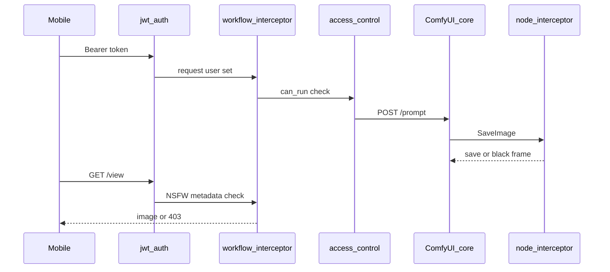

# Image generation pipeline

This guide describes how a client (mobile app, script, or Comfy Portal) runs a workflow on a ComfyUI instance protected by MSS-Login, from authentication through to downloading output images.

## Overview

ComfyUI owns execution after you submit a prompt. MSS-Login adds:

- **Authentication** — who is calling
- **RBAC** — whether they may run, upload, or access APIs
- **Model validation** — workflow may not reference models the user cannot use
- **Per-user isolation** — optional separate output folders and queue history (`SEPERATE_USERS`)
- **NSFW enforcement** — at save time and when serving `/view`



## Step 1: Obtain a token

Use a long-lived **API token** for mobile apps. See [Authentication](authentication.md).

```http
POST /mss-login/generate_token
Content-Type: application/json

{"username": "user", "password": "password"}
```

Store the returned token securely. Send it as:

```http
Authorization: Bearer <token>
```

## Step 2: Confirm identity and permissions

```http
GET /mss-login/api/me
Authorization: Bearer <token>
```

Check that the user's role allows `can_run` and `can_access_api`. Without `can_run`, `POST /prompt` returns **403**.

Optional: `GET /mss-login/api/is-https` if you need to build absolute URLs for assets.

## Step 3: Discover node definitions

Load ComfyUI's node schema so you can build or validate workflow JSON:

```http
GET /object_info
Authorization: Bearer <token>
```

Model list endpoints (`GET /models/{folder}`, `GET /embeddings`) are **filtered** per user unless they have `can_view_all_comfyui_items`.

## Step 4: Submit a workflow

```http
POST /prompt
Authorization: Bearer <token>
Content-Type: application/json

{
  "prompt": { ... },
  "client_id": "your-app-client-id"
}
```

The `prompt` object is standard ComfyUI workflow JSON (node IDs → class type, inputs, etc.).

### What MSS-Login does on submit

1. **JWT middleware** — resolves user from Bearer token, cookie, or query.
2. **Workflow interceptor** — records the username for NSFW policy in worker threads; runs **model validation** (`validate_prompt_models`). If the workflow references a checkpoint/LoRA/etc. the user cannot use, response is **403** with `MODEL_NOT_ALLOWED`.
3. **RBAC** — denies if `can_run` is false.
4. **Queue patch** (when `SEPERATE_USERS=true`) — stamps `user_id` on queue items; filters history/queue per user.

ComfyUI then queues and executes the graph normally.

## Step 5: Monitor progress

Use any combination:

| Method | Endpoint / URL |
|--------|----------------|
| WebSocket | `ws://host/ws?token=<token>` — progress, previews, completion |
| Queue | `GET /queue` |
| History | `GET /history` |

Send the same token on WebSocket (query param is typical for mobile).

!!! note "Preview images"
    MSS-Login disables latent previews globally to reduce NSFW leakage over WebSocket. Rely on `/history` and `/view` for final outputs.

## Step 6: Fetch output images

When execution completes, history entries reference output files. Request:

```http
GET /view?filename=<name>&subfolder=<subfolder>&type=output
Authorization: Bearer <token>
```

### Success and failure

| Status | Meaning |
|--------|---------|
| **200** | Image bytes returned |
| **403** | NSFW blocked for this user (SFW enforced and image flagged) |
| **401** | Missing or invalid token |

If `SEPERATE_USERS=true`, outputs are stored under per-user prefixes; use the `filename` / `subfolder` values from **your** history entry.

## Workflows (save / load)

Per-user workflow storage uses ComfyUI's userdata API (intercepted by MSS-Login):

| Action | Method | Path |
|--------|--------|------|
| List | GET | `/api/userdata?dir=workflows` |
| Load | GET | `/api/userdata/workflows/{filename}` |
| Save | POST | `/api/userdata/workflows/...` (requires `can_modify_workflows`) |
| Delete | DELETE | same base path |

Details: [Workflow & intercepted endpoints](../api-reference/workflow-endpoints.md).

## Uploading inputs

```http
POST /upload/image
Authorization: Bearer <token>
```

Requires `can_upload`. Use returned filename in workflow `LoadImage` nodes.

## Error codes to handle in mobile apps

| Code / body | Cause |
|-------------|--------|
| 401 | Token missing, expired, or revoked |
| 403 `can_run` | Role cannot execute prompts |
| 403 `MODEL_NOT_ALLOWED` | Workflow uses a model the user cannot access |
| 403 NSFW on `/view` | Output blocked for SFW user |
| MFA challenge on login | Complete MFA before obtaining API token |

## Middleware order (reference)

For debugging, requests pass through (among others): IP filter → sanitizer → remote API guard → **JWT auth** → **workflow interceptor** → model filter → folder access → **RBAC** → handler.

## Custom nodes

MSS-Login does not register ComfyUI graph nodes. NSFW enforcement hooks **core** `SaveImage` / `PreviewImage` (and some animated save nodes). Third-party nodes that write images without those classes may bypass save-time checks; `/view` may still block based on metadata when available. See [NSFW and outputs](nsfw-and-outputs.md).

## See also

- [Authentication](authentication.md)
- [Headless JWT session](headless-jwt-session.md)
- [NSFW and outputs](nsfw-and-outputs.md)
- [ComfyUI client APIs](../api-reference/comfyui-client-endpoints.md)
- [Mobile and Comfy Portal](../integrations/comfy-portal.md)
